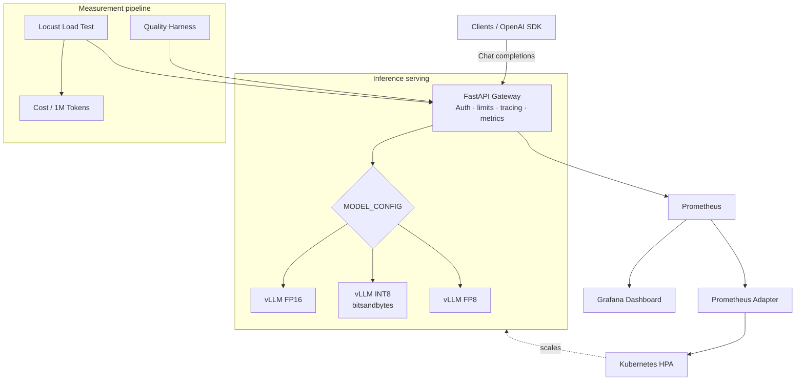
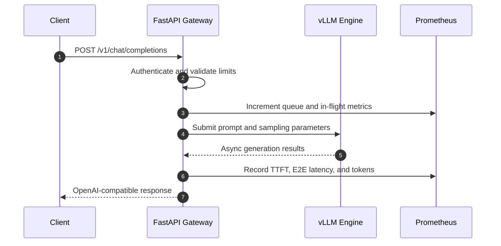
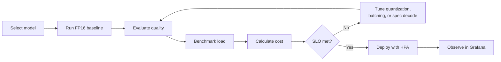
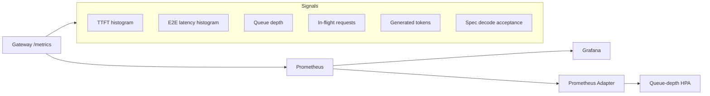

# LLM Inference Optimizer

<p align="center">
  <strong>Measure and optimize the quality, latency, throughput, and cost of production LLM inference.</strong>
</p>

<p align="center">
  
  
  
  
  
</p>

An end-to-end toolkit for comparing vLLM inference configurations under the
same workload. It combines an OpenAI-compatible gateway, FP16/INT8/FP8
configuration profiles, repeatable quality evaluation, Locust load testing,
cost modeling, Prometheus metrics, Grafana dashboards, and queue-aware
Kubernetes autoscaling.

> [!IMPORTANT]
> This is GPU infrastructure software. Run vLLM on a supported Linux/CUDA
> host. FP8 requires a GPU with compute capability 8.9 or newer.

## Why this project?

Choosing an inference configuration is a multi-objective optimization problem:
the fastest option is not always the cheapest, and the cheapest option may
reduce output quality. This project makes those trade-offs measurable.

| Question | Measurement |
|---|---|
| How quickly does the model respond? | Time to first token and end-to-end latency |
| How much traffic can it serve? | Requests/sec and generated tokens/sec |
| What does inference cost? | Estimated USD per one million output tokens |
| Does quantization reduce quality? | Exact match and embedding similarity delta |
| Will it scale under load? | Queue-depth-driven horizontal pod autoscaling |
| Is speculative decoding effective? | Acceptance rate and before/after latency |

## System architecture



## Request lifecycle



## Optimization workflow



## Features

- **OpenAI-compatible API** at `/v1/chat/completions`
- **Continuous batching** through vLLM's asynchronous engine
- **Config-driven quantization** for FP16, INT8, and FP8 comparisons
- **Optional speculative decoding** with acceptance-rate telemetry
- **Quality regression testing** using exact match and semantic similarity
- **Load generation** with p50, p95, p99, RPS, and failure reporting
- **Cost modeling** from measured throughput and hourly GPU price
- **Production controls** including API-key auth, rate limiting, input bounds,
  structured logs, CORS policy, and graceful draining
- **Observability** through Prometheus metrics and an importable Grafana dashboard
- **Kubernetes deployment** with GPU scheduling, probes, persistent model cache,
  disruption budgets, and queue-depth autoscaling
- **Terraform infrastructure** for reproducible cloud provisioning

## Repository layout

```text
.
├── gateway/                 # FastAPI + vLLM inference service
│   ├── app.py
│   ├── config/models.yaml   # Model, batching, and quantization profiles
│   └── Dockerfile
├── eval/                    # Quality evaluation harness and sample dataset
├── benchmark/               # Locust workload and cost calculator
├── k8s/
│   ├── helm/                # Gateway, service, HPA, PVC, and secrets
│   └── prometheus/          # Adapter config and Grafana dashboard
├── terraform/               # Cloud GPU infrastructure
├── scripts/                 # End-to-end phase runner
├── tests/                   # CPU-only gateway unit tests
└── docs/PRODUCTION_AUDIT.md # Deployment risks and production checklist
```

## Requirements

### Local development

- Python 3.10+
- Linux, WSL2, or a Linux container for vLLM
- NVIDIA driver and a CUDA-compatible GPU
- Docker with NVIDIA Container Toolkit (recommended)

### Full deployment

- Kubernetes cluster with schedulable NVIDIA GPU nodes
- `kubectl` and Helm 3
- Prometheus, Prometheus Adapter, and Grafana
- Terraform (optional)

### GPU compatibility

| Profile | Typical requirement | Notes |
|---|---|---|
| FP16/BF16 | CUDA-capable GPU with sufficient VRAM | Baseline quality profile |
| INT8 | CUDA GPU supported by vLLM/bitsandbytes | Lower memory footprint |
| FP8 | Compute capability ≥ 8.9 | Ada, Hopper, or newer |

The default model is `Qwen/Qwen2.5-3B-Instruct`. Adjust
`gateway/config/models.yaml` to fit the available VRAM. A 0.5B–1.5B model is a
safer starting point for an 8 GB development GPU.

## Quick start

### 1. Create an environment

```bash
python -m venv .venv
source .venv/bin/activate
pip install -r gateway/requirements.txt
pip install -r benchmark/requirements.txt
```

### 2. Configure and start the gateway

For local development without authentication:

```bash
export MODEL_CONFIG=fp16
export GATEWAY_ALLOW_NO_AUTH=1
uvicorn gateway.app:app --host 0.0.0.0 --port 8000
```

For an authenticated environment:

```bash
export MODEL_CONFIG=fp16
export GATEWAY_API_KEY="$(openssl rand -hex 32)"
uvicorn gateway.app:app --host 0.0.0.0 --port 8000
```

### 3. Send a request

```bash
curl http://localhost:8000/v1/chat/completions \
  -H "Content-Type: application/json" \
  -H "X-API-Key: ${GATEWAY_API_KEY}" \
  -d '{
    "model": "default",
    "messages": [{"role": "user", "content": "Explain continuous batching."}],
    "max_tokens": 256,
    "temperature": 0.2
  }'
```

When `GATEWAY_ALLOW_NO_AUTH=1`, omit the `X-API-Key` header.

## Configuration profiles

Profiles live in `gateway/config/models.yaml` and are selected with
`MODEL_CONFIG`.

```bash
MODEL_CONFIG=fp16 uvicorn gateway.app:app --port 8001
MODEL_CONFIG=int8 uvicorn gateway.app:app --port 8002
MODEL_CONFIG=fp8  uvicorn gateway.app:app --port 8003
```

Only start profiles supported by the available hardware. Multiple concurrent
profiles generally require multiple GPUs; a single-GPU machine should run them
sequentially.

## Quality evaluation

```bash
python eval/quality_harness.py \
  --configs fp16,int8,fp8 \
  --gateway-urls http://localhost:8001,http://localhost:8002,http://localhost:8003 \
  --dataset eval/datasets/eval_set_sample.jsonl \
  --out eval/results/quality_report.json
```

Set `GATEWAY_API_KEY` when evaluating authenticated gateways. Use at least 200
representative examples before making production quality decisions.

## Load testing

```bash
locust -f benchmark/locustfile.py \
  --host http://localhost:8001 \
  --users 50 \
  --spawn-rate 5 \
  --run-time 5m \
  --headless \
  --csv benchmark/results/fp16_run
```

Repeat the run for every configuration under the same workload. The Locust
client automatically sends `GATEWAY_API_KEY` when it is present.

## Cost calculation

From Locust CSV output:

```bash
python benchmark/cost_calculator.py \
  --configs fp16,int8,fp8 \
  --throughput-csv benchmark/results/fp16_run_stats.csv,benchmark/results/int8_run_stats.csv,benchmark/results/fp8_run_stats.csv \
  --gpu-hourly-cost 2.50 \
  --out benchmark/results/cost_report.json
```

Or from directly measured throughput:

```bash
python benchmark/cost_calculator.py \
  --configs fp16,int8,fp8 \
  --tokens-per-sec 850,1400,2100 \
  --gpu-hourly-cost 2.50
```

Formula:

```text
cost per 1M tokens = hourly GPU cost / (tokens per second × 3,600) × 1,000,000
```

## Observability



Exported metrics:

- `gateway_requests_total`
- `gateway_inflight_requests`
- `gateway_queue_depth`
- `gateway_ttft_seconds`
- `gateway_e2e_seconds`
- `gateway_tokens_generated_total`
- `gateway_spec_decode_acceptance_rate`

Import `k8s/prometheus/grafana-dashboard.json` into Grafana to visualize the
serving and cost/latency signals.

## Kubernetes deployment

Create the API-key secret outside source control, then deploy:

```bash
kubectl create namespace inference
kubectl -n inference create secret generic gateway-secrets \
  --from-literal=api-key="$(openssl rand -hex 32)"

helm upgrade --install llm-optimizer ./k8s/helm \
  --namespace inference
```

Review `k8s/helm/values.yaml` first. Configure the image repository, enabled
profiles, GPU node selector, resources, storage class, and replica limits for
the target cluster.

## Full pipeline

On a Linux GPU host:

```bash
chmod +x scripts/run_all_phases.sh
./scripts/run_all_phases.sh
```

The script smoke-tests serving profiles and runs the available evaluation and
benchmark phases. Concurrent quality comparison requires gateways to be running
on the configured ports.

## Verification

CPU-only checks:

```bash
pytest -q
python -m compileall -q gateway eval benchmark tests
helm lint ./k8s/helm
helm template llm-optimizer ./k8s/helm
terraform -chdir=terraform init -backend=false
terraform -chdir=terraform validate
```

## Production guidance

Read [`docs/PRODUCTION_AUDIT.md`](docs/PRODUCTION_AUDIT.md) before deployment.
It documents authentication, denial-of-service limits, graceful shutdown,
GPU scheduling, model caching, secrets, TLS, and remaining operator decisions.

Do not commit API keys, Hugging Face tokens, cloud credentials, `.env` files,
Terraform state, or generated benchmark data.

## Roadmap

- Streaming OpenAI responses
- Tokenizer-native chat templates
- Automated sequential single-GPU comparison
- Confidence intervals and significance testing
- Multi-model routing policies
- CI integration tests on GPU runners

## Contributing

Issues and pull requests are welcome. Keep benchmark conditions reproducible,
include hardware and software versions, and never present synthetic throughput
as measured production performance.

## Acknowledgements

Built with FastAPI, vLLM, Locust, Prometheus, Grafana, Kubernetes, Helm, and
Terraform.
